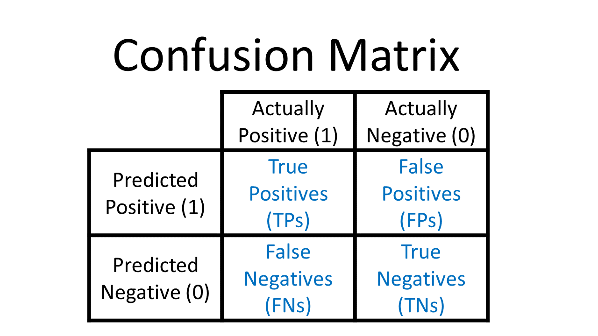

# Role of Confusion Matrix in Cyber-Security

## First Lets Understand What is a Confusion Matrix.
A Confusion matrix is an N x N matrix used for evaluating the performance of a classification model, where N is the number of target classes. The matrix compares the actual target values with those predicted by the machine learning model. This gives us a holistic view of how well our classification model is performing and what kinds of errors it is making. For a binary classification problem, we would have a 2 x 2 matrix.

#### Understanding True Positive, True Negative, False Positive and False Negative in a Confusion Matrix

True Positive (TP)
* The predicted value matches the actual value
* The actual value was positive and the model predicted a positive value

True Negative (TN)
* The predicted value matches the actual value
* The actual value was negative and the model predicted a negative value

False Positive (FP) – Type 1 error
* The predicted value was falsely predicted
* The actual value was negative but the model predicted a positive value
* Also known as the Type 1 error

False Negative (FN) – Type 2 error
* The predicted value was falsely predicted
* The actual value was positive but the model predicted a negative value
* Also known as the Type 2 error

### Now Lets Have a look at a example:
We have a total of 10 cats and dogs and our model predicts whether it is a cat or not.

Actual values = [‘dog’, ‘cat’, ‘dog’, ‘cat’, ‘dog’, ‘dog’, ‘cat’, ‘dog’, ‘cat’, ‘dog’]
Predicted values = [‘dog’, ‘dog’, ‘dog’, ‘cat’, ‘dog’, ‘dog’, ‘cat’, ‘cat’, ‘cat’, ‘cat’]

> ***From the above discussion so far we Understand that False positive is the most dangerous as here the machine does false prediction with positive value. example. machine predicts the patient is having no diabetes but actually the patient have diabetes.***

## Now Lets Understand How confusion matrix contributes to Cyber-Security

Cybersecurity refers to the practice of ensuring the integrity, confidentiality, and availability (ICA) of information. Cybersecurity is comprised of an evolving set of tools, risk management approaches, technologies, training, and best practices designed to protect networks, devices, programs, and data from attacks or unauthorized access.

#### The Detection of Attack and Normal Pattern Can be Generalized using Confusion matrix as follows:

**True Positive (TP)**: The amount of attack detected when it is actually attacked.

**True Negative (TN)**: The amount of normal detected when it is actually normal.

**False Positive (FP)**: The amount of attack detected when it is actually normal (False alarm).

**False Negative (FN)**: The amount of normal detected when it is actually attacked.

> **Confusion matrix contains information on actual and predicted classifications done by a classifier. The performance of a cyber-attack detection system is commonly evaluated using the data in a matrix.**

**References**:
* https://en.wikipedia.org/wiki/Confusion_matrix
* http://irphouse.com/ijcis/ijcisv4n2_02.pdf

## Thankyou For Reading
Any query and suggestion are always welcome- [Gaurav Pagare](https://www.linkedin.com/in/gaurav-pagare-8b721a193/)
